<div align="center">
  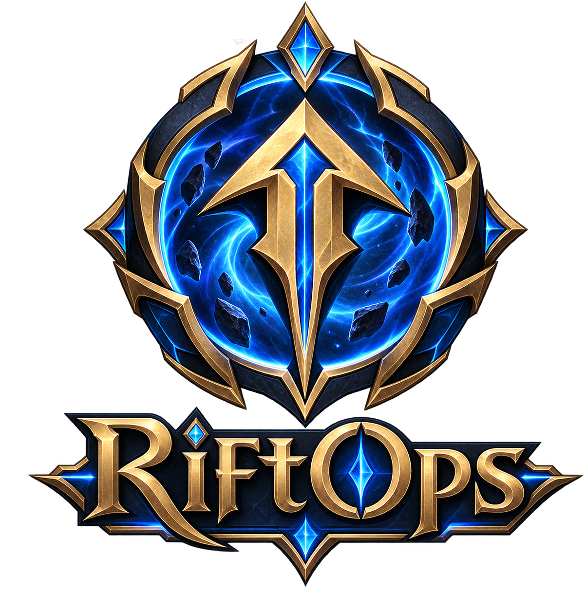
  <h1>RiftOps</h1>
  <p><strong>The Local-First League of Legends Operations Deck & Companion for Windows and macOS</strong></p>
  <p>Launch Riot games, automate safe queue workflows, track live matches, explore your skin vault, and inspect Hextech loot from one unified cockpit.</p>

  <p>
    <a href="https://github.com/HassanSalah120/RiftOps/releases"></a>
    <a href="https://github.com/HassanSalah120/RiftOps/actions/workflows/ci.yml"></a>
    <a href="https://github.com/HassanSalah120/RiftOps/releases"></a>
    <a href="#-ban-safe-architecture"></a>
    <a href="PRIVACY.md"></a>
    <a href="LICENSE"></a>
  </p>

  <p>
    <a href="#-feature-showcase">Explore Features</a> ·
    <a href="#-quick-start">Quick Start</a> ·
    <a href="#-ban-safe-architecture">Ban-Safe Architecture</a> ·
    <a href="#-phone-companion-mimic-style-lan-control">Phone Control</a> ·
    <a href="https://github.com/HassanSalah120/RiftOps/releases">Downloads</a> ·
    <a href="PRIVACY.md">Privacy Policy</a>
  </p>
</div>

---

<div align="center">
  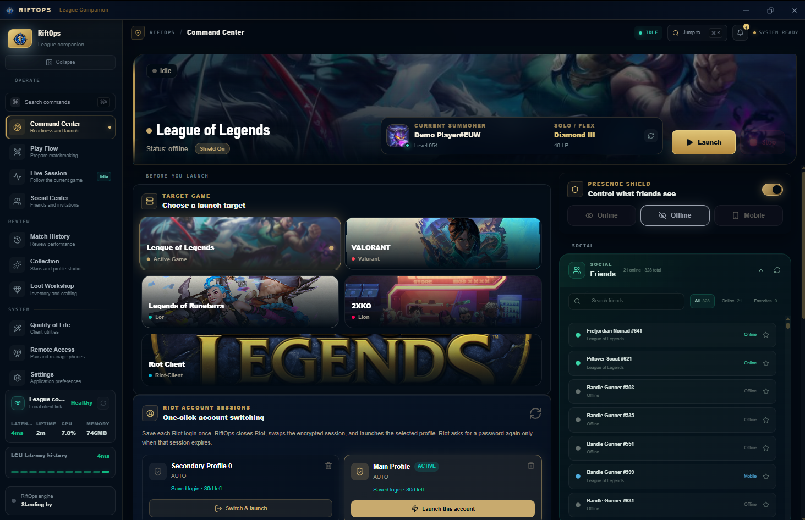
  <p><em>Command Center: Real-time summoner rank and LP telemetry, 1-click Riot title launchpad, instant Presence Shield, and DPAPI-encrypted account switching.</em></p>
</div>

---

## ⚡ Highlights at a Glance

- 🛡️ **100% Ban-Safe & Memory-Free**: Operates exclusively via Riot's official League Client API (LCU) and Game Client Data API (`127.0.0.1:2999`). Zero DLL injection, zero hooking, and zero Pengu Loader.
- 🚀 **Multi-Game Launchpad**: One-click launcher for League of Legends, VALORANT, Legends of Runeterra, 2XKO, and the Riot Client.
- 🎭 **Native Streamer & Privacy Mode**: One toggle anonymizes summoner names, profile IDs, and friend identities with lore-friendly aliases across all screens.
- 💎 **Cosmetic Vault**: Explore and filter all 1,940+ skins with real ownership indicators, splash art, chromas, and craftable loot shards.
- 🛠️ **Hextech Loot Workshop**: Real spendable balances with authentic in-game currency icons (BE, OE, RP, Mythic Essence, Keys) and 1-click recipe inspector.
- 🤖 **Grind Mode Automation**: Persistent auto-accept queue pops, auto-return to lobby, auto-honor ally, and auto-claim event battle pass milestones.
- 📱 **Zero-Cloud Phone Companion**: Pair any phone on your local Wi-Fi with a 5-minute single-use QR code to accept queues and manage champion select remotely.

---

## 📸 Feature Showcase

### 1. Cosmetic Vault & Skin Collection
Browse every skin on your account alongside the ones still missing with instant multi-filtering, splash artwork, and craftable shard indicators.

<div align="center">
  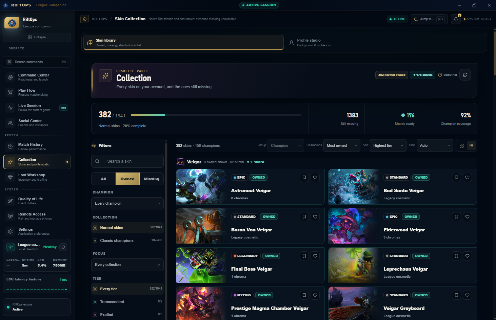
</div>

- **Authentic Collection Stats**: Live counts for owned normal skins, champion coverage percentage, and shard readiness.
- **Deep Filtering**: Filter by champion, ownership status (All / Owned / Missing), tier (Epic, Legendary, Mythic, Standard, Legacy), and chromas.
- **Splash Art Resolution**: Instant high-resolution artwork loaded from Riot Data Dragon and CommunityDragon caching.

---

### 2. Hextech Loot Workshop
Spendable wallet and crafting workstation with authentic League of Legends currency iconography and interactive recipe inspection.

<div align="center">
  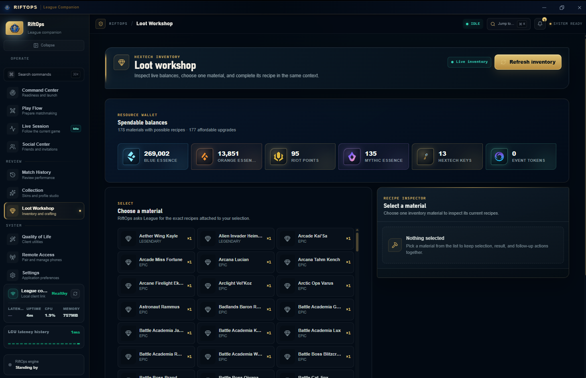
</div>

- **Genuine Currency Icons**: Live spendable balances for Blue Essence, Orange Essence, Riot Points, Mythic Essence, Hextech Keys, and Event Tokens.
- **Recipe Inspector**: Select any champion shard, skin shard, or chest to inspect its upgrade, disenchant, or reroll recipes.
- **Batch Processing**: Disenchant duplicate champion shards or forge keys without tedious client lag.

---

### 3. Profile Studio & Live Regalia
Personalize how your summoner card, profile background, and prestige badges appear to others without leaving the workspace.

<div align="center">
  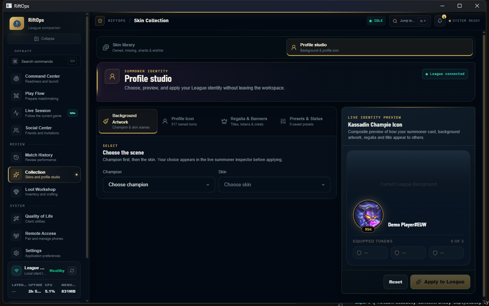
</div>

- **Composite Summoner Inspector**: Live preview of your summoner card, level badge, equipped challenge tokens, and rank regalia.
- **Custom Background Scenes**: Set your League client profile backdrop to any owned champion splash art.
- **Owned Icon Library**: Visual search and instant selection across your entire library of owned summoner icons.

---

### 4. Quality of Life & Automation Engine
Automate repetitive League Client tasks, save queue position presets, manage chat presence, and create safe settings snapshots.

<div align="center">
  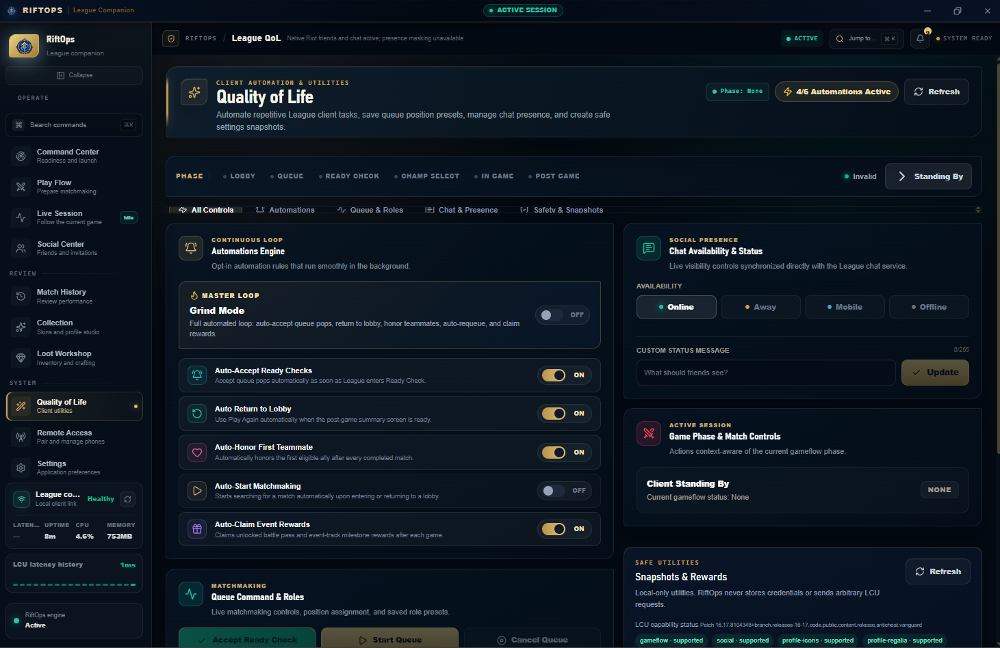
</div>

- **Grind Mode Master Loop**: Automatically accept queue pops, return to lobby post-game, honor teammates, auto-requeue, and claim rewards.
- **Stealth Presence Switcher**: Seamlessly switch between Online, Away, Mobile, or completely Offline (invisible presence via loopback XMPP).
- **Phase-Aware Controls**: UI buttons dynamically enable and disable based on the active League matchflow phase (Lobby, Queue, Ready Check, Champ Select, In-Game, Post Game).

---

### 5. Play Flow & Matchmaking Pipeline
One-click matchmaking runbook: set primary and secondary lane preferences, create lobbies, and queue up with instant feedback.

<div align="center">
  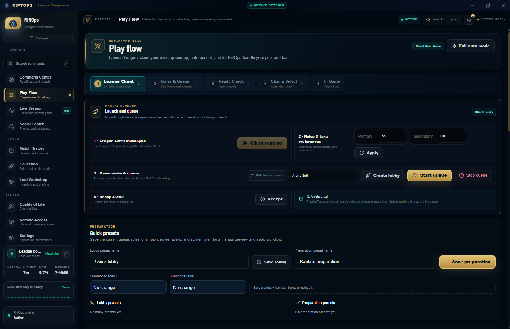
</div>

- **Role & Lane Preferences**: Validate and save primary/secondary roles (Top, Jungle, Mid, Bot, Support, Fill) directly to the lobby.
- **Mode Selector**: Jump straight into Ranked Solo, Ranked Flex, Normal Draft, ARAM, or Arena.
- **Safe Rehearsal**: Practice and test draft workflows safely in Practice Tool before live queues.

---

### 6. Canonical Live Session
Follow your match from queue pop through Champion Select, loading screen, active in-game telemetry, and post-game debrief.

<div align="center">
  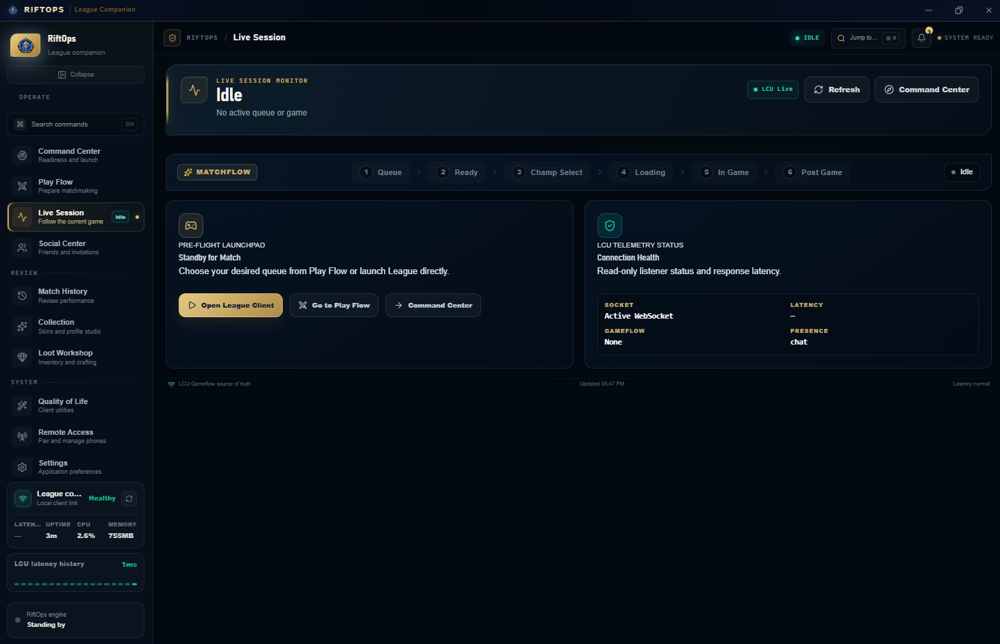
</div>

- **Continuous 6-Phase Pipeline**: Real-time transition tracking across Queue, Ready Check, Champ Select, Loading, In Game, and Post Game.
- **Live Game Client Telemetry**: Reads Riot's official Game Client Data API (`https://127.0.0.1:2999/liveclientdata/allgamedata`) during active games for gold, KDA, CS, and objectives.
- **Arena Telemetry**: Dedicated tracking for Arena rounds, placements, augments, and partner health.

---

### 7. Social Center & Privacy Shield
Fast, lightweight friend directory with built-in Streamer Mode and bulk lobby invitations.

<div align="center">
  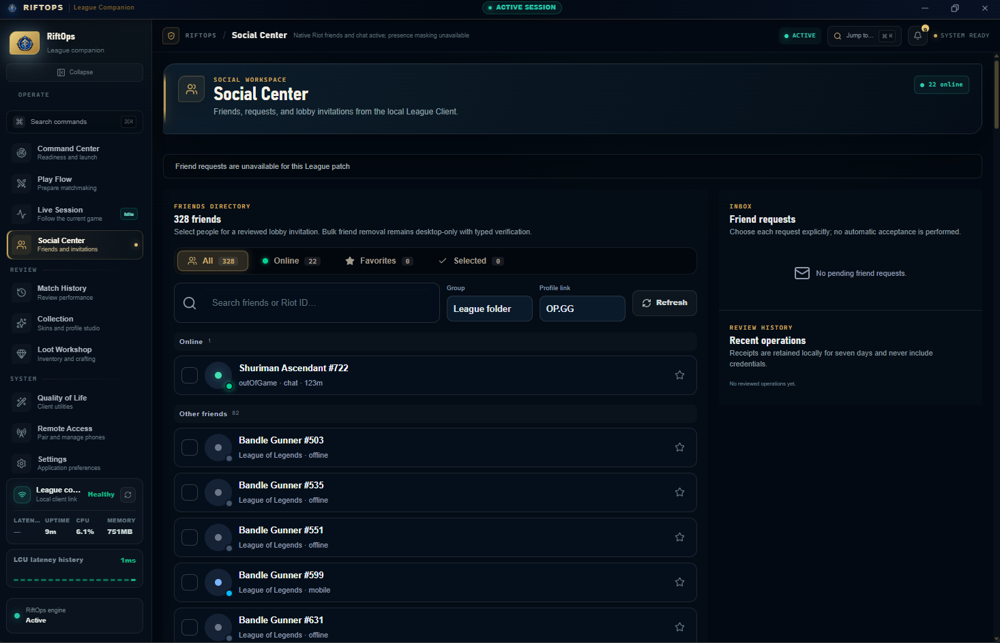
</div>

- **Streamer Privacy Shield**: Obfuscates friend names into lore-friendly aliases (e.g., *Targon Stargazer*, *Bandle Gunner*, *Piltover Scout*) to prevent stream sniping.
- **Direct Profile Links**: One-click access to OP.GG profiles for teammates and friends.
- **Lobby Invitations**: Invite online friends directly from the social center into your active party.

---

### 8. Application Settings & Encrypted Account Switcher
Granular workspace control, Riot Client executable auto-detection, and DPAPI-secured session storage.

<div align="center">
  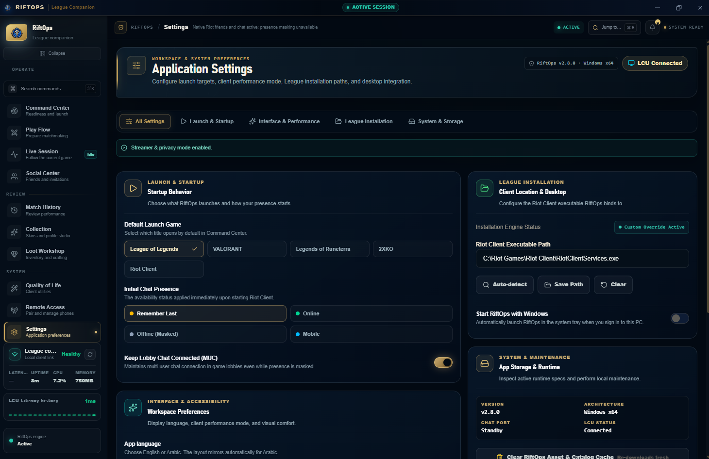
</div>

- **One-Click Account Switching**: Save remembered Riot logins to named launch profiles. Swap accounts without typing passwords.
- **Operating System Protection**: Sessions are encrypted with **Windows DPAPI** on Windows and the **macOS Keychain** on macOS. RiftOps never stores plaintext passwords.
- **Auto-Detection**: Scans the Windows Registry and macOS `/Applications` to automatically locate Riot Client and League executables on any drive.

---

### 9. Match History & Performance Analytics
Deep match telemetry, KDA trends, champion performance, and timeline breakdowns.

<div align="center">
  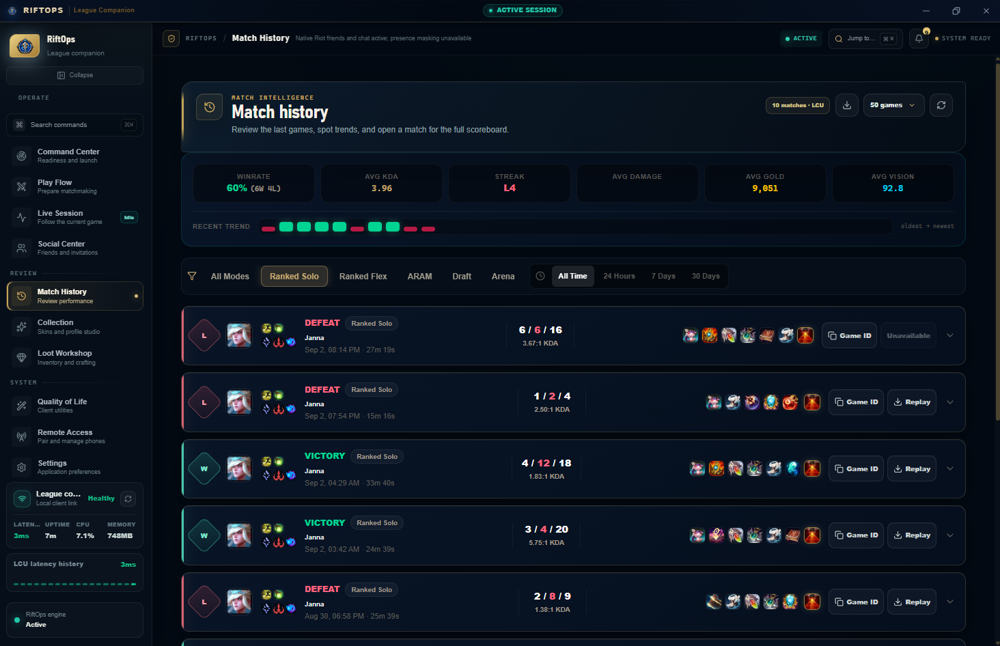
</div>

- **Timeline Breakdown**: Full game timelines with gold differentials, objective timers, and item builds.
- **Role & Champion Analytics**: Track performance across individual champions and assigned lanes.
- **Direct OP.GG Integration**: One-click lookup for all participants in previous matches.

---

## 📱 Phone Companion (Mimic-Style LAN Control)

RiftOps includes a local-first mobile companion inspired by Mimic. It communicates directly with your desktop over your home Wi-Fi network—**no external servers or cloud relays are involved**.

<div align="center">
  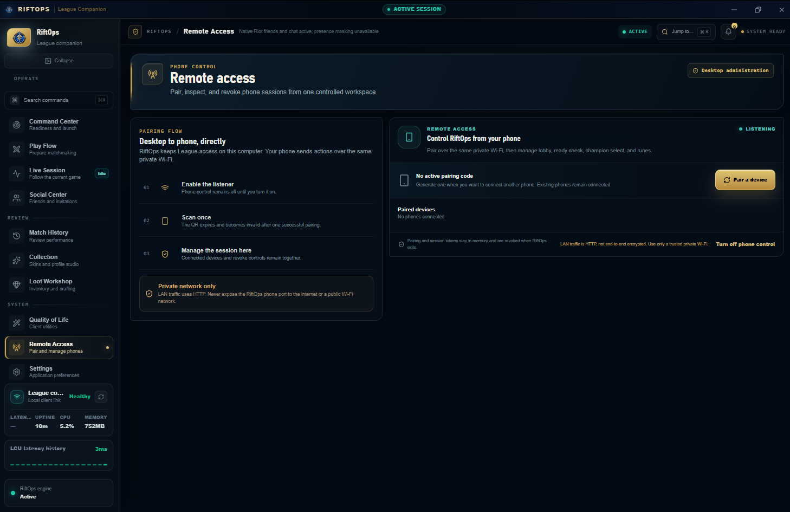
</div>

```
┌─────────────────┐       Wi-Fi LAN (HTTP)       ┌────────────────────────┐
│  Mobile Device  │ ◄──────────────────────────► │  RiftOps Desktop Hub   │
│  (Phone / Pad)  │  Single-use QR / Session     │  (Port 24080 / Local)  │
└─────────────────┘                              └───────────┬────────────┘
                                                             │ Loopback API
                                                 ┌───────────▼────────────┐
                                                 │   League Client (LCU)  │
                                                 │   (127.0.0.1:Port)     │
                                                 └────────────────────────┘
```

1. Open **Remote Access** under System in RiftOps.
2. Click **Turn on** to activate the local network listener.
3. Scan the displayed QR code with your smartphone camera.
4. Accept queue pops, lock in your hover pick, swap rune pages, and monitor live match status from anywhere in your house.

> [!NOTE]
> Pairing QR codes expire after 5 minutes and become invalid immediately upon first use. Mobile sessions are strictly bounded to safe gameflow actions; sensitive capabilities (account credentials, settings, loot crafting, and diagnostics) remain desktop-only.

---

## 🛡️ Ban-Safe Architecture

RiftOps was engineered from the ground up to ensure complete compliance with Riot Games' policies and Vanguard anti-cheat rules:

| Category | Unsafe Third-Party Tools | RiftOps Architecture |
|---|---|---|
| **Process Memory** | Reads/writes game RAM; injects DLLs | **Zero memory access**. Does not attach to `League of Legends.exe`. |
| **DirectX / GPU Hooks** | Injects overlay hooks into DirectX/Vulkan pipelines | **Standalone desktop app**. Uses native OS windowing with zero graphics hooking. |
| **Client Code Injection** | Injects JS/CSS into client DOM via Pengu Loader | **Zero client modification**. Interacts only through standard HTTP/WebSocket LCU APIs. |
| **Credential Safety** | Stores passwords or sends tokens to third-party servers | **Zero password storage**. Uses OS DPAPI / Keychain encryption locally. |
| **Network Safety** | Routes traffic through hosted cloud relays | **100% Local Loopback**. All operations execute between your PC and local LCU. |

---

## 🚀 Quick Start

### Windows (10 / 11)

1. Download the latest `RiftOps-<version>-win-x64.exe` from the [Releases Page](https://github.com/HassanSalah120/RiftOps/releases).
2. Place the executable in a preferred folder (e.g., `C:\RiftOps` or `D:\RiftOps`).
3. Launch **RiftOps.exe**. It will automatically detect your Riot Client and League installations.
4. Launch League of Legends, sign in, and enjoy your new operations deck!

> [!TIP]
> **Windows SmartScreen Note**: While our open-source application with the SignPath Foundation is pending, Windows releases are published unsigned and may trigger an *Unknown Publisher* SmartScreen alert. Click **More Info** → **Run Anyway**. You can verify the build integrity against the published `.sha256` checksum.

### macOS (12+)

1. Download `RiftOps-macOS.zip` from [Releases](https://github.com/HassanSalah120/RiftOps/releases).
2. Extract the archive and move `RiftOps.app` to your `/Applications` directory.
3. Control-click `RiftOps.app` and select **Open** on first launch.
4. If macOS flags the download quarantine, run this in Terminal:
   ```sh
   xattr -dr com.apple.quarantine /Applications/RiftOps.app
   ```

---

## ⌨️ Command Palette & Keyboard Shortcuts

Press `Ctrl+K` (Windows) or `Cmd+K` (macOS) from anywhere in RiftOps to open the fuzzy-search command palette.

| Shortcut | Action |
|---|---|
| <kbd>Ctrl</kbd> + <kbd>K</kbd> / <kbd>Cmd</kbd> + <kbd>K</kbd> | Open Command Palette |
| <kbd>Alt</kbd> + <kbd>1</kbd> | Navigate to Command Center |
| <kbd>Alt</kbd> + <kbd>2</kbd> | Navigate to Play Flow |
| <kbd>Alt</kbd> + <kbd>3</kbd> | Navigate to Live Session |
| <kbd>Alt</kbd> + <kbd>4</kbd> | Navigate to Social Center |
| <kbd>Alt</kbd> + <kbd>5</kbd> | Navigate to Match History |
| <kbd>Alt</kbd> + <kbd>6</kbd> | Navigate to Skin Collection |
| <kbd>Alt</kbd> + <kbd>7</kbd> | Navigate to Loot Workshop |
| <kbd>Alt</kbd> + <kbd>8</kbd> | Navigate to Quality of Life |
| <kbd>Alt</kbd> + <kbd>9</kbd> | Navigate to Application Settings |

---

## 🛠️ Building from Source

### Prerequisites
- **Go**: 1.24 or newer
- **Node.js**: 20.x or newer & `npm`
- **CGO Compiler**: MinGW-w64 (Windows) or Xcode Command Line Tools (macOS)

### 1. Build the Frontend
```sh
cd cmd/riftops-ui/frontend
npm install
npm test
npm run build
cd ../../..
```

### 2. Build the Desktop App
**Windows:**
```powershell
./scripts/build-windows.ps1 -Build 1
```

**macOS:**
```sh
bash ./scripts/build-macos.sh
```

The output binary will be generated under `dist/RiftOps-<version>-win-x64.exe` (or `dist/RiftOps-macOS.zip`).

---

## 🔒 Privacy & Data Commitment

RiftOps adheres to strict local-first privacy principles:
- **No telemetry or analytics trackers**.
- **No account data or passwords sent to remote servers**.
- **Diagnostic logs are scrubbed** of authorization headers, tokens, and file paths.
- Read our full [Privacy Policy](PRIVACY.md) and [Safe Feature Manifesto](SAFE_FEATURES.md).

---

## 📄 License

RiftOps is licensed under the [GNU General Public License v3.0](LICENSE).  
Third-party notices and open-source licenses are documented in [THIRD_PARTY_NOTICES.md](THIRD_PARTY_NOTICES.md).

*RiftOps isn't endorsed by Riot Games and doesn't reflect the views or opinions of Riot Games or anyone officially involved in producing or managing Riot Games properties. Riot Games, and all associated properties are trademarks or registered trademarks of Riot Games, Inc.*
